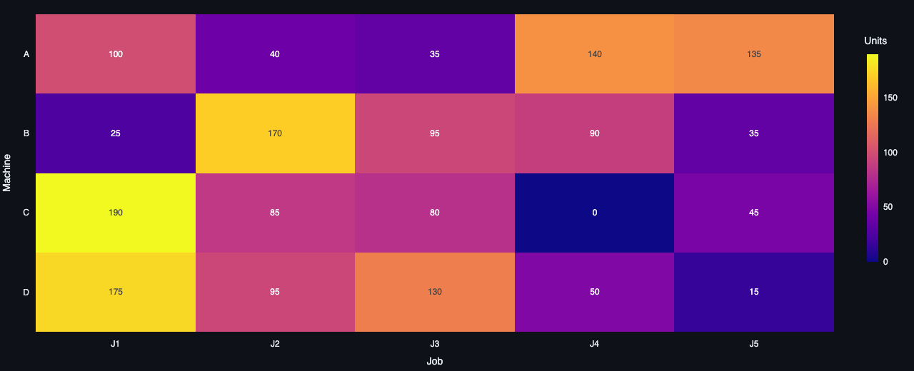

# Industrial Capacity & Resource Planning Optimizer

**[Live Demo →](https://nihalnazeer-industrial-capacity-optimiz-appstreamlit-app-vzjtsu.streamlit.app)**

Comparing two production-planning strategies — plan for one demand forecast, or plan across multiple demand scenarios — to quantify the cost of getting demand wrong.

---

## Problem

Capacity commitments (shifts, machine time) are made *before* actual demand is known. A plan optimized for one forecast is efficient if that forecast is right, and expensive if it isn't.

**Question:** how much does planning for a single forecast cost you when demand deviates — and does hedging across scenarios actually pay off?

---

## Approach

| | Deterministic | Scenario-Based |
|---|---|---|
| Plans against | Expected demand only | Low / Expected / High, weighted by probability |
| Capacity decisions | Fixed in advance | Fixed in advance (same as deterministic) |
| Demand fulfillment evaluated | 1 scenario | All 3 scenarios |

Both are LP/IP models (PuLP, CBC solver). Same decision variables — units produced per job/machine/period, regular time ($x$) and overtime ($y$) — the only difference is whether unmet demand ($u$) is penalized for one scenario or averaged across all three, weighted by probability ($p_s$):

$$\min \sum cost_m \cdot x + cost^{OT}_m \cdot y \;+\; \sum_s p_s \cdot \pi \cdot u_s$$

*(Deterministic sets $p_{\text{expected}}=1$, everything else 0.)*

> Called **scenario-based**, not *robust* optimization — this minimizes expected cost across weighted scenarios (stochastic programming), not worst-case cost ($\min\max_s$). A true minimax variant is future work.

---

## Results

| Metric | Deterministic | Scenario-Based |
|---|---:|---:|
| Production Cost | $9,760 | $12,789 |
| Worst-Case Cost | $35,710 | $19,089 |
| Utilization | 75.2% | 92.3% |
| Unmet Demand (worst-case scenario) | 519 units | 126 units |

**Takeaway:** Scenario-based planning costs 31% more under expected demand, but cuts worst-case cost by 46% and worst-case unmet demand by 76%. The deterministic plan is cheaper only if the forecast holds — it isn't hedged against anything else.

---

## Allocation Heatmap



*Scenario-based plan: units produced per machine/job. Full interactive version (with plan toggle) is in the [live app](https://nihalnazeer-industrial-capacity-optimiz-appstreamlit-app-vzjtsu.streamlit.app).*

---

## Data

Synthetic, deliberately structured — not random — so the optimizer faces real trade-offs: 4 machines (cheap/low-capacity → expensive/high-capacity → limited-overtime), 5 job types, 5 periods, regular capacity set below peak demand so overtime and unmet demand both actually get used.

---

## Stack

PuLP (CBC) · pandas · Streamlit · Plotly

---

## Structure

```
├── data/            job/machine/scenario CSVs
├── src/
│   ├── model.py       LP formulations
│   ├── solve.py         solver + result extraction
│   ├── scenarios.py     scenario loading/scaling
│   ├── metrics.py       KPI computation
│   └── evaluate.py      orchestrates comparison
├── app/streamlit_app.py
└── reports/figures/
```

---

## Future Work

- Minimax robust formulation ($\min\max_s Cost_s$)
- Link predicted equipment failures (from a companion RUL model) as a live capacity constraint